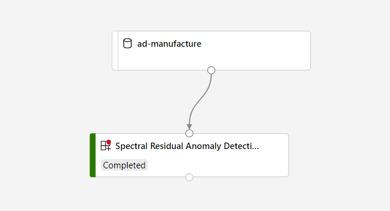

# Spectral Residual Anomaly Detection Component

This folder specifies the Spectral Residual Anomaly Detection component that can be used in Azure Machine Learning designer. The details of the Spectral Residual algorithm can be found at https://arxiv.org/pdf/1906.03821.pdf.

## Component Specification

This section describes the specification of [Spectral Residual Anomaly Detection Component](./ad_component.yaml).

### Input Specification

* `Input`. AnyDirectory type means you need to register your dataset as **File dataset** to the workspace. The data set should contain at least 12 rows. Each row should contain a timestamp column and one or more columns that are to be detected.
* `Detect Mode`. The following two detect modes are supported.
  1. `AnomalyOnly`. In this mode, the module outputs columns `isAnomaly`, `mag` and `score`.
  2. `AnomalyAndMargin`. In this mode, the module outputs columns `isAnomaly`, `mag`, `score`, `expectedValue`, `lowerBoundary`, `upperBoundary`.
* `Timestamp Column`. The column that contains timestamp. The timestamp should be in ascending order. No duplication is allowed in timestamp.
* `Value Column`. One or more columns that are to be detected. The data in these columns should be numeric. Absolute value greater than 1e100 is not allowed.
* `Batch Size`. The number of rows to be detected in each batch. The batch size should be at least 12. Set this parameter to 0 or negative number if you want to detect all rows in one batch.
* `Threshold`. In AnomalyOnly mode, points are detected as anomaly if its `score` is greater than threshold. In AnomalyAndMargin mode, this parameter and `sensitivity` works together to filter anomaly.
* `Sensitivity`. This parameter is used in AnomalyAndMargin mode to determine the range of the boundaries.
* `Append result column to output`. If this parameter is set, the input data set will be output together with the results. Otherwise, only the results will be output.

### Output Specification
The output data set will contain a fraction of the following columns according to the `Detect Mode` parameter. If multiple value colums are selected, the result columns will add value column names as postfix.
* `isAnomaly`. The anomaly result.
* `mag`. The magnitude after spectral residual transformation.
* `score`. A value indicates the significance of the anomaly.
In AnomalyAndMargin mode, the following columns will be output in addition the the above three columns.
* `expectedValue`. The expected value of each point.
* `lowerBoundary`. The lower boundary at each point that the algorithm can tolerant as not anomaly.
* `upperBoundary`. The upper boundary at each point that the algorithm can tolerant as not anomaly.

## How to create a new component in Azure Machine Learning

Follow [this tutorial](https://github.com/Azure/AzureMachineLearningGallery/blob/main/tutorial/tutorial1-use-existing-components.md) to create a new component in your Azure Machine Learning workspace. 

After creating component successfully, you can use it in Azure Machine Learning designer.

## How to build a pipeline in AML designer

1. Prepare input dataset for the component.
    Register this [sample AnomalyDetector-Manufacture dataset](https://github.com/microsoft/Cognitive-Samples-IntelligentKiosk/blob/master/Kiosk/Assets/AnomalyDetector/AnomalyDetector-Manufacture.csv) as **Tabular dataset** in your Azure Machine Learning workspace.

    The dataset above is a sample dataset. You can use your own dataset, make sure that it is registered as Tabular dataset and you can also preprocess your dataset using Designer built-in modules. Make sure that the input dataset of **Spectral Residual Anomaly Detection** is with following format, and the count of time series must be more than 12:

    |Timestamp|Value|
    |---|---|
    |2018/7/1 0:00|22|
    |2018/7/1 2:00|22|
    |2018/7/1 4:00|22|
    |2018/7/1 6:00|22|
    |2018/7/1 8:00|52.93218322|
    |2018/7/1 10:00|52.81943684|
    |2018/7/1 12:00|52.33277765|
    |2018/7/1 14:00|52.82106858|
    |2018/7/1 16:00|52.93218322|
    |2018/7/1 18:00|22|
    |2018/7/1 20:00|22|
    |2018/7/1 22:00|22|
    |2018/7/2 0:00|22|
    |2018/7/2 2:00|22|
    |2018/7/2 4:00|22|
    |2018/7/2 6:00|22|

1. Open AML designer, create a new pipeline draft and drag the registered dataset to canvas.
    
    Add **Spectral Residual Anomaly Detection** to canvas, connect it to the dataset, and configure the parameters. The pipeline graph is like following:

    

1. Submit the pipeline.
1. When the pipeline runs completed, you can click on **Visualize** icon in the **Outputs+logs** tab in the right panel of the **Spectral Residual Anomaly Detection** module, or right-click the module to select **Visualize**.

